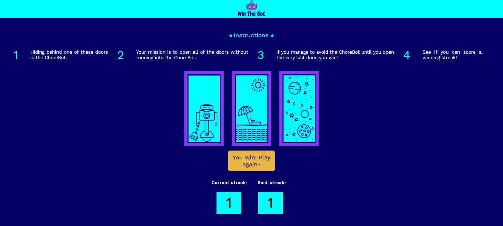
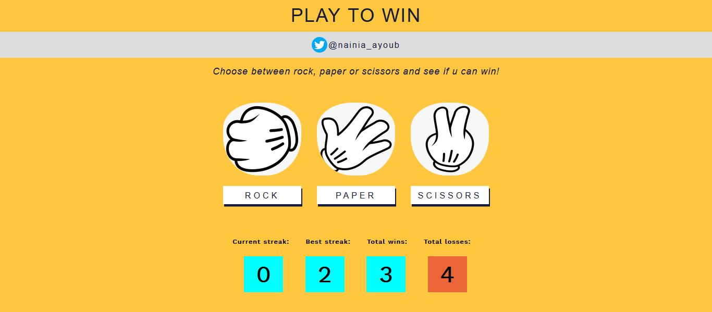
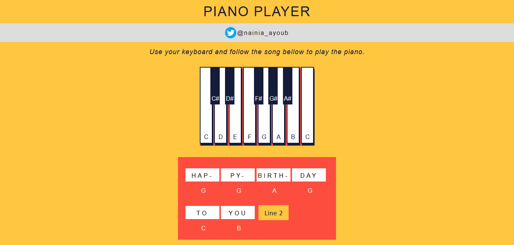

# Hands-on-JavaScript-projects
This repository contains some of the projects I am building during my #100DaysOfCode challenge with JavaScript.
# Motivation
The projects above document the process of getting familiar with JavaScript, starting by implementing the basic concepts of the DOM (Data Object Model) with hands on fun projects, in which you will get your hands dirty just like I'm doing.  
# All projects
1. :point_right: [Win The Bot game](https://codepen.io/nainia_ayoub/full/XWmowyb)  
  
2. :point_right: [Rock, Paper or Scissors game](https://codepen.io/nainia_ayoub/full//ZEbNYjL)  
  
3. :point_right: [Piano Player](https://nainiayoub.github.io/Hands-on-JavaScript-projects/Piano-Player/)  
  
4. :point_right: [The Moroccan Vibe](https://nainiayoub.github.io/Hands-on-JavaScript-projects/The%20Moroccan%20Vibe/index.html)  
