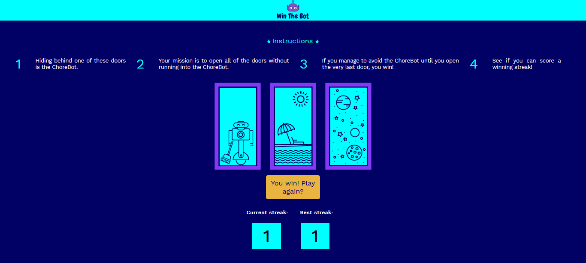

# Win The Bot
This project is a single web site page that represents the __Win The Bot__ game.
# Game Instructions #
1. Hiding behind one of the three doors is the ChoreBot.
1. Your mission is to open all of the doors without running into the ChoreBot.
1. If you manage to avoid the ChoreBot until you open the very last door, you win!
1. See if you can score a winning streak!
# Motivation #
In this project you are going to leverage the DOM _(Document Object Model)_ as a Tree Structure by :
* Selecting and modifying elements.
* Styling elements.
* Handling events.
# Screenshot #
You can check out the project here :point_right: [WinTheBot](https://codepen.io/nainia_ayoub/full/XWmowyb) 

